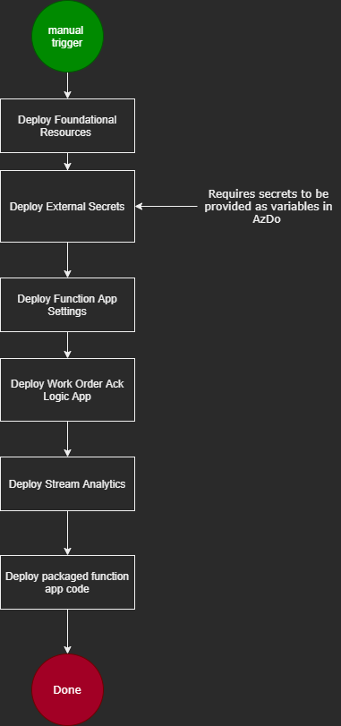

# CI/CD Pipelines Defined

This documentation focuses on explaining the Continuous Integration/Continuous Deployment (CI/CD) pipelines and the approaches that have been deployed for the Field Service Connector. Within the Field Service Connector we are targeting three different use cases when it come to the CI/CD Pipelines. They are defined as:

1. New Environment Setup: This scenario is the initial deployment of resources into a clean environment. This could be a new environment such as dev, test, or prod within an existing client implementation or a the initial deployment of a client.
1. Ongoing development code deployment: This scenario also revolves around the ongoing development, maintenance and customer specific implementation of the solution's code. But, it focuses on the deployment of the modifications. This scenario drives towards only deploying the modified bits. A full pipeline deployment isn't required and the tax on the deployment time isn't warranted.
1. Ongoing development code integration: This scenario revolves around the ongoing development and maintenance of the solution's code, as well as client specific implementations and upgrades. Engineers working on the code base are going to want to ensure the code being deployed compiles and unit tests still function as changes are made to the code base. They value quick turn around and feedback on whether the integration is successful.

## Continuous Deployment Step Definitions

While we are targeting two different deployment pipeline scenarios, they are nothing more than pulling together the same pieces of the pipeline for the different configurations. The different pieces that are available are:

- Deploy Foundational Resources: This step will deploy the bulk of the Azure Resources that are needed for the solution, to include:
  - Key Vault
  - Service Bus
    - Access policies for sending and receiving are created
    - Topics and Queues are configured
    - Access policy secrets are added to the key vault
  - App Insights
    - Instrumentation Key is added to the key vault
  - Azure Function App
  - App Service Plan
  - Log Analytics Workspace
  - Storage Account
    - Connection string is added to the key vault
  - Optionally: IoT Hub
    - Create an IoT Device in the IoT Hub
    - Service access key is added to the key vault

> Executes an incremental deploy of /deployment/azure/azure-deploy.json

- Deploy Key Vault Secrets: This step will add external secrets to the Key Vault. These secrets will be used by resources later in the pipeline and are required to be present for those resources to successfully deploy. Secrets that are expected for this pipeline include:

  - Dynamics Client Id
  - Dynamics Secret
  - Optionally IoTHub Access Key

    This step in the pipeline will be configured to expect these secrets when run. This step in the pipeline is broken out because each customer will have their own operations and processes for dealing with secrets. How they are put into the vault may vary from client to client, so this step may need to be modified on a per customer situation.

> Executes an incremental deploy of /deployment/azure/key-vault-secrets/azure-deploy.json

- Deploy Function App Settings: This step will deploy the app settings of the Azure Function App. This step is broken out from the foundation for two different reasons:
  - The dependance on external secrets to be in the key vault prior to being referenced by the Function App.
  - This is associated with a logical layer and the frequency of change will be greater in these settings than other areas of the foundation.

> Executes an incremental deploy of /deployment/azure/function-apps/azure-deploy.json

- Deploy Work Order Ack Logic App: This step not only deploys the Logic App, but also the API connections required for the Logic App to function. This step is broken out from the foundation for two different reasons:
  - The dependance on external secrets to be in the key vault prior to being referenced by the API Connections.
  - This is a logical layer and the frequency of change will be greater in these settings than other areas of the foundation.

> Executes an incremental deploy of /deployment/azure/logic-apps/work-order-ack/azure-deploy.json

- Deploy Stream Analytics: This step will deploy the Stream Analytics job that filters the stream of events in the IoT Hub to just the faults we're interested in. It will configure the inputs, outputs and the query used to filter the stream. This step is broken out from the foundation for two different reasons:
  - The dependance on external secrets to be in the key vault prior to being referenced by the Stream Job.
  - This is a logical layer and the frequency of change will be greater in these settings than other areas of the foundation.

> Executes an incremental deploy of /deployment/azure/stream-analytics/azure-deploy.json

- Deploy packaged function app code: This will deploy the compiled code from the Dynamics-Connector to the Azure Function App. This step has a dependency on the CI pipeline for the function app being run. The CI and CD portions of the code being separated allows for the CI components to be a part of the branch policies and run for every PR that modifies the code. It also allows for the CD portion of the component to be executed against many environments using the same compiled code for each.

## New Environment Setup

This approach requires a method to deploy all of the resources into a clean environment. It needs to account for the one-time setup bits that are only required during that initial deployment. We want to automate as much of this deployment as possible as it is also the jump start for on-boarding through OSS. That said we need to acknowledge that many of the one-time setup components require external intervention to accomplish.

The steps of the deployment are:

## Ongoing Development Code Deployment

The largest differences between this scenario and the previous is that is assumes an existing environment has been created and we're merely making incremental improvements to the environment by deploying only the bits that have been modified. So instead of a manual trigger the trigger is automated when changes to specific components of the system are merged into the main branch.

The break out of these deployments are:

## Ongoing Development Code Integration

This approach needs to account for the desire to have a fast turn around on the checks. Part of what will hinder that turn around is running code integration validation steps on areas that were not changed. As each of the CI pieces are broken down into the different components of the system, the impact of modifications to one component on another component won't be seen from the CI pipelines. Those impacts will only be seen from the System Integration tests which can't be performed until the resources are deployed.

So we chose to implement a CI approach that has a different CI YAML file for each of the components. The branch policies will be configured so that they are only triggered when there are changes made to the component under test.

There are primarily 3 different types of CI steps to be run, with the only difference being the path configuration of the branch policy and the path of the source code being tested.

1. ARM Template Validation: This step will combine the parameters that have been configured, the ARM template specified, and the pipeline specific variables to run an azure group deployment in validation mode. If the validation succeeds, the CI pipeline reports a success.
2. Markdown Lint: This step is used to run markdown linting rules against all markdown files within the repo. As there is a possibility of housing README.md files within any of the components source directories this branch policy is configured to run when any \*.md file is changed in the repo.
3. Code CI Template: This step will run the standard tasks that is required for any .NET Core project. It will compile the code, run unit tests, run static code analysis, and publish the results of each of these.

With these 3 base types of CI steps in place we can configure 8 different CI pipelines to execute only when needed. Those are shown in this diagram:

## Creating Pipelines In Azure Dev Ops

The new environment, CI, and CD pipelines each rely on [YAML files](../.azdo/pipelines). Each file defines triggers as well as the different tasks to execute as part of the pipeline. These files simply need to be referenced from a new pipeline, and Azure Dev Ops will automatically run the steps defined in the .yaml file when the trigger condition is met. In order to create a new pipeline, navigate to **Pipelines** -> **New Pipeline**. Select **Azure Repos Git** for the source code provider, then the appropriate repository. Finally, select **Existing Azure Pipelines YAML File** and find the appropriate YAML file from the **Path** dropdown.

Each YAML file specifies the variables that must be added to the Azure Dev Ops pipeline in a comment at the beginning of the file. Find the **Variables** window and add each of the variables stipulated by the YAML file. If the variables contains sensitive information, ensure "Keep this value secret" is selected.

Some pipeline files do not declare trigger conditions, like the [Foundational Resources CI](../.azdo/pipelines/cd/foundational-resources-cd.yml). Azure Dev Ops can still run these pipelines automatically through branch policies, however. Find the **Project Settings** window and navigate to **Repositories**. Select the repository, open the **policies** pane, and select the appropriate branch. The page should contain a **Build Validation** section that enables you to create Build Policies. From the Build Policy creation window, select an existing ADO pipeline to run, and supply a path variable that will define the trigger condition for the policy. When changes are made to files that are included in the supplied path variable, the selected Azure Dev Ops pipeline will execute.

## Resources

[Create an Azure Dev Ops Pipeline](https://docs.microsoft.com/azure/devops/pipelines/create-first-pipeline)

[YAML Schema Reference](https://docs.microsoft.com/azure/devops/pipelines/yaml-schema)

[Define Pipeline Variables](https://docs.microsoft.com/azure/devops/pipelines/process/variables)

[Azure Dev Ops Repository Settings](https://docs.microsoft.com/azure/devops/repos/git/repository-settings)

[Azure Dev Ops Branch Policies](https://docs.microsoft.com/azure/devops/repos/git/branch-policies)
