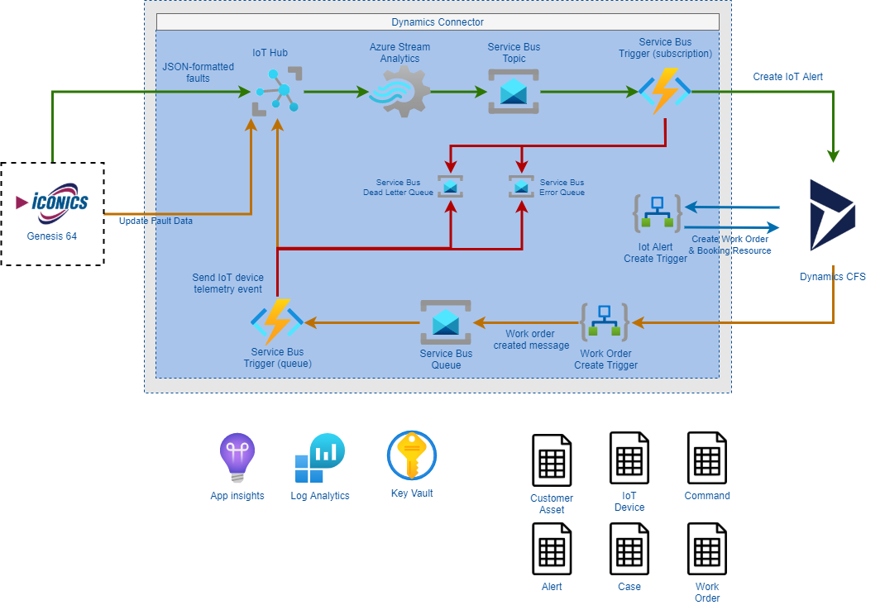

# Dynamics Field Service Connector setup

## Introduction

This document outlines steps to setup the Dynamics Field Service Connector. It will cover deployment of the base (or foundational) infrastructure, configuration of the Connector, optional components, and references.

### Prerequisite

- [Azure CLI >= 2.11.1](https://docs.microsoft.com/en-us/cli/azure/install-azure-cli)
- [Dotnet Core 3.1](https://dotnet.microsoft.com/download/dotnet-core/3.1)
- [Azure Functions Core Tools >= 3.0.2881](https://docs.microsoft.com/en-us/azure/azure-functions/functions-run-local)
- [Dynamics Field Service](https://docs.microsoft.com/en-us/dynamics365/field-service/overview)
- Service Principal to access Dynamics Field Service
- Service Principal that has contributor rights to at least the resource group being deployed to. In case of conditional creation of the resource group, contributor rights to the subscription for deployment.
- Download the source code from repository

*Note* : Please refer to [Dynamics-365-Setup.md](Dynamics-365-Setup.md) to get more details about Dynamics 365 Field service setup.

### Components

Dynamics Field Service Connector as a solution consist of various Azure services. Below are the list of the services, which will be deployed as configure as part of this solution:

- IoT Hub: Used to receive events from and send events to ICONICS.

- Azure Stream Analytics:  Consumes the "fault" events (telemetry) from IoT Hub and performs pre-processing (data filtering) on the data.

- Azure Service Bus

- Azure function

- Logic Apps
- Key Vault
- Application Insights
- Log Analytics workspace

Apart from above Azure services, Dynamics Field Service Connector is dependent on the below two components:

- Dynamics 365 Field Service

- ICONICS

*Note* : Please refer Annexure to get more details about overall architecture.

### Configure Service Principal to access Dynamics Field Service

Dynamics 365 Field Service, can be accessed using a service principal. Below are the steps to configure service principal to access Field Service.

#### Register an App against Azure Active Directory

1. Log into [https://portal.azure.com](https://portal.azure.com/), navigate to Azure Active Directory -&gt; App registrations and click on New application registration

    

2. Create the new App registration with Web app / API as the Application Type

3. Setup client secret key by navigating to Settings -&gt; Keys, create a new Key and save to generate a new Secret key value

#### Create a new Dynamics 365 Application user

1. Log into Dynamics 365 Online, navigate to Settings -&gt; Security -&gt; Users and change the view to Application Users. Click on New to open a new Application User Form.

    

2. Fill in the following fields.

    I.  The value of the
     ID field will be the GUID value
        obtained from previous steps

    

    II. Once saving the record the following fields will be auto
        populated by Dynamics 365

3. Add user to the following roles: Field Service – Administrator, IoT - Endpoint User, and IoT - Administrator.


### Setup

#### Base infrastructure setup

Scripts for the base infrastructure are placed in `deployment` folder. Ensure you have logged into Azure and set the correct Azure subscription like so:

```bash
az login
az account set --subscription XXXXXXXXX
```

Below are the steps required to setup the base infrastructure

- Navigate to `deployment\azure\scripts` folder.
- edit full-env-deploy.sh and fill values of
  - GROUPID="<>"
  - ENVIRONMENT="d" `You can use d for Development, t for Test, i for Integration and p for Production. Please refer Naming Convention section in Annexure for more details about naming conventions`
  - LOCATION="westus2" `For regions with long names, such as North Central US, you can use the designated abbreviation, for example, "West US" is westus and "Central US" is centralus`
  - DYNAMICS_ENDPOINT="<>.crm"
  - DYNAMICS_CLIENT_ID="XXXXXXXXXXXX"
  - DYNAMICS_SECRET="XXXXXXXXXXXX"
- If you have existing IoT Hub set value of  
  - `INCLUDE_IOT_HUB` to false replace value of
  - `IOT_HUB_NAME` with external IoT Hub Name
  - `IOT_HUB_SECRET` with external IoT Hub Secret.
- If you want to create new IoT Hub set value of  
  - `INCLUDE_IOT_HUB` to true and leave values of `IOT_HUB_NAME` and `IOT_HUB_SECRET` untouched.
  - `IOT_HUB_FAULT_DEVICE_ID` to be updated optinally with desired IoT Device Name.
- run ./full-env-deploy.sh from script folder

This will ask for consent. Enter Y to continue.

- Once script run is complete. you can see below message


- After the full enviroment is successfully deployed, the Stream Analytics Job needs to be manually started.


### Environment setup validation

Once Environment setup is done, you can validate the environment.

- Go to Azure portal and open the newly created resource group. In resource group you can find services deployed as part of setup
- Go to IoT Hub - > Explorer -> IoT Devices. You can find at least 1 device with name 'BXConnector'
  
- Open Service Bus namespace -> Entities -> Queue. You can find 2 queues
  

- Open Stream Analytics Job -> Job Topology -> Query. You can find 1 Input, 1 Output and a query.
  

- Open Function app -> Functions - > Functions . You can find 2 functions
 

- Open Application Insights
 

### Optional setup

There are few optional components, which can be deployed/configured along with other services.

- **Application Insight:**
As part of base infrastructure setup, Application Insight has been deployed. The Azure Functions are configured to use Application Insights via the provided Application Insights instrumentation ID . IoT Hub can also be configured to send diagnostic data to  Log Analytics Workspace. You can write queries that may be helpful in finding key information logged via Application Insights. Please refer [Logging and Diagnostic Data](Logging.md) for sample queries. Please see Microsoft Offical Documentation for more details about [log query](https://docs.microsoft.com/en-us/azure/azure-monitor/log-query/log-query-overview)

- **Circuit Breaker**
 If you want to automatically stop the creation of Dynamics Field Service IoT Alerts if more than 20 errors are detected within 1 minute,
so that the Dynamics system does not continually receive requests it is unable to process, and
so that messages do not continually fail and subsequently get moved to a dead-letter queue. You can deploy Circuit breaker. Circuit Breaker is deployed as an Azure Function as shown below.  


    Circuit breaker uses [Managed Identity](https://docs.microsoft.com/en-us/azure/app-service/overview-managed-identity?tabs=dotnet)for Azure Function. To get Circuit Breaker managed Identity object id, open circuit breaker function -> settings -> Identity and copy the object ID.
    
    Script file set-rbac.sh take cares of role assignment.  To run the script, please provide values of RESOURCE_GROUP_NAME, SERVICE_PRINCIPAL_OBJECT_ID and run the script.

### Troubleshooting guide

- **issue**

    

    **Cause**: Azure Function Core tools not installed

    **Resolution**: Install
[Azure Functions Core Tools >= 3.0.2881](https://docs.microsoft.com/en-us/azure/azure-functions/functions-run-local)

- **issue** Error while running full-env-deploy.sh
`-bash: ./full-env-deploy.sh: /bin/bash^M: bad interpreter: No such file or directory`

    **Cause**: Due to  carriage return character difference between windows and Unix.

    **Resolution**: Remove the spurious CR characters by running  `sed -i -e 's/\r$//' full-env-deploy.sh` or `dos2unix full-env-deploy.sh`

### Annexure

#### Naming Convention

##### Resource type

These characters are an acronym for the resource type, for example:

| Resource type | Acronym |
|---------------|---------|
| Storage account | sa |
| Storage account V2 | sa2 |
| Function app | fa |
| Logic app | la |
| Integration account | iact |
| Service Bus | sb |
| Network security group | nsg |
| Resource group | rg |
| Event hub | eh |
| Event Grid subscription | egs |
| Log Analytics workspace | law |
| Log Analytics solution | las |
|||

##### Environment

This character represents the environment where the resource is used, for example:

| Environment | Character |
|-------------|-----------|
| Development | d |
| Test | t |
| Integration | i |
| Production | p |
|||

#### High Level Design

- ICONICS publishes fault events in a configured format  to Azure IoT Hub.

- Azure Stream Analytics (ASA) consumes the fault events from Azure IoT Hub. It also provides temporal processing (time-based). ASA jobs will be custom to the customer implementation. ASA outputs the fault(s) to an Azure Service Bus topic.
- Azure Service Bus is the output sink for the ASA job.
   It allows an Azure Function to serve as a subscriber.  The pub/sub mechanism allows for future use by other subscribers.
- A Service Bus triggered Azure Function performs any additional customer-specific business logic and creates an [IoTAlert entity](https://docs.microsoft.com/dynamics365/customer-engagement/web-api/msdyn_iotalert?view=dynamics-ce-odata-9) (and any needed Asset) in Dynamics Field Service.
- A Logic App will trigger based on the creation of a new Dynamics Field Service work order.
- The Logic App uses the work order data to place a message in a Service Bus queue
- A Service Bus queue-triggered Azure Function receives the message and sends a cloud-to-device message.
- ICONICS subscribes to the MQTT device topic (provided by Azure IoT Hub)
- Components such as Application Insights, Log Analytics workspace, and Key Vault are shared resources.  They are not core components of the processing pipeline.  However, they are vital to the operation of the pipeline.



### References

[Logging and Diagnostic Data](Logging.md)

[Dynamics 365 Field Service Environment Setup](Dynamics-365-Setup.md)

[Naming convention details](naming-convention.md)

[ICONICS Connector setup](#TODO)
