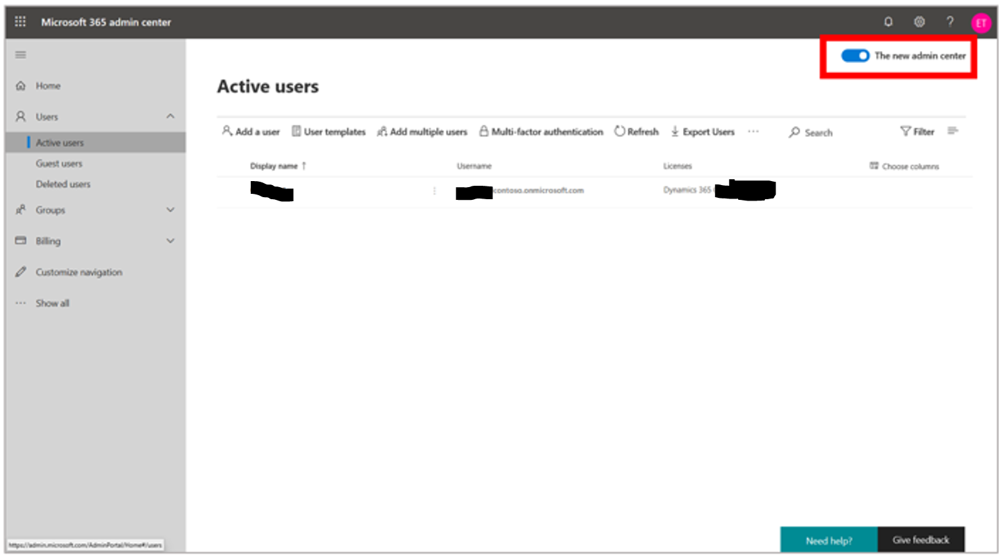
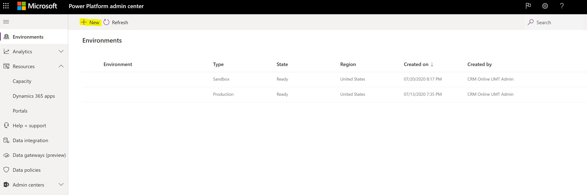
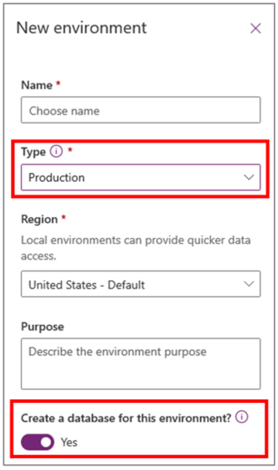
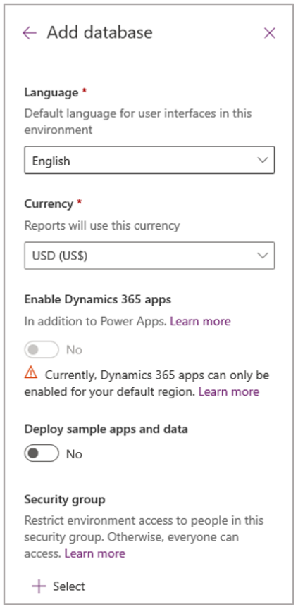
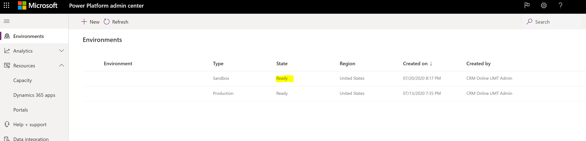
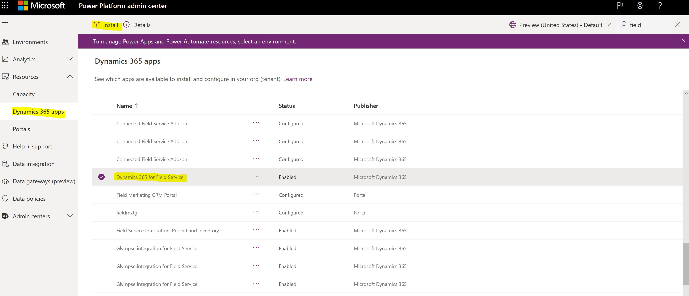
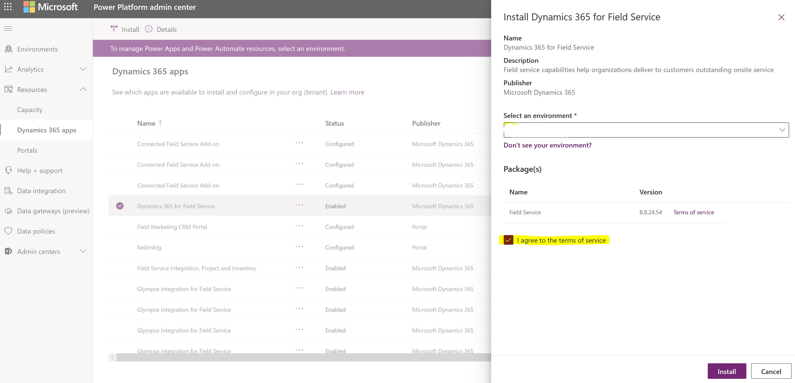
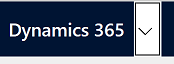
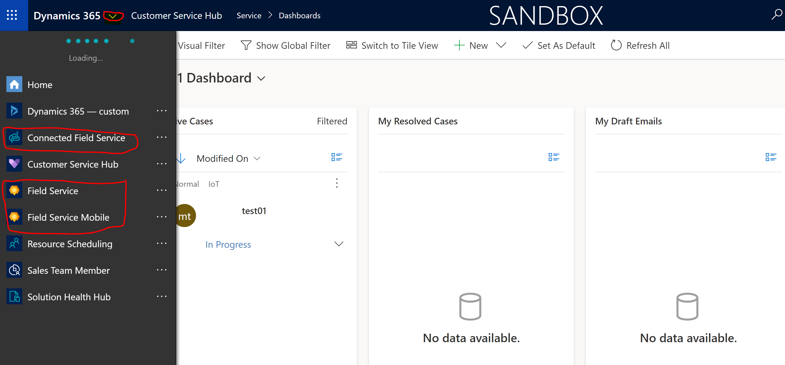

# Microsoft Dynamics 365 Guides - create new environment and assigning licenses

## Prerequisites

Field Service and Connected Field Service require a specific instance of Dynamics 365 for model-driven apps. This guide assumes that you have already provisioned this instance type and have enough licenses for all dev and test users.

If you do not have an instance yet, the options are documented here: <https://docs.microsoft.com/en-us/dynamics365/admin/add-instance-subscription>

More specifically, the [Field Service](https://admin.microsoft.com/AdminPortal/Home#/catalog/offer-details%252Fdynamics-365-field-service%252F8D652447-35FF-4587-83DD-4396F645B1BC) link in the catalog will allow the M365 administrator the ability to add new licenses and provision new instances.

## Field Service Install

1) Open [Microsoft 365 admin
center](https://admin.microsoft.com/AdminPortal/Home) (<https://admin.microsoft.com/AdminPortal/Home>)
and make sure that the **The new admin center** option in the upper
right corner of the page is turned on.

    

2) Select **Manage product licenses**.

3) In the dialog box, under **Licenses**, select the **Dynamics 365
Field Service** check box.

4) In the **Apps** list, make sure that the following apps are
selected: Common Data Service, Dynamics 365 Field Service, Power Apps
for Field Service.

## Create an environment

1) In the [Power Platform admin
center](https://admin.powerplatform.microsoft.com/environments) select **Environments** if it
isn't already selected, and then select **New**.

2) The **New environment** dialog box appears on the right side of
the page.

    

3) In the New environment dialog box, follow these steps:

    a)  Enter a name for the environment.

    b)  In the Type field, select Production.

    

    c)  In the Region field, keep the default setting.

    d)  Set the Create a database for this environment? option to Yes.

    e)  Select Next.

4) In the **Add database** pane that appears on the right side of the
screen, select your language and currency, keep the default settings for
the other fields, and then select **Save**.

    

A screenshot is shown that explains that the production environment is
ready.

## Install and configure the solution

Go to <https://admin.powerplatform.microsoft.com/resources/applications>
in the left pane, select **Resources** &gt; **Dynamics 365 apps**,
select **Dynamics 365 for Field Service** in the list, and then
select **Install**.

In the **Dynamics 365 for Field Service** dialog box, select an
environment, select the **I agree to the terms of service** check box,
and then select **Install**.

## Validate the environment setup

1) Open your Microsoft Dynamics 365 instance.

2) Click on arrow next to the Dynamics 365 header text.

    

3) Make sure you can see Field Service apps.

    

4) Click on Field Service should open the power app to display active Work Orders and IoT Alerts.
