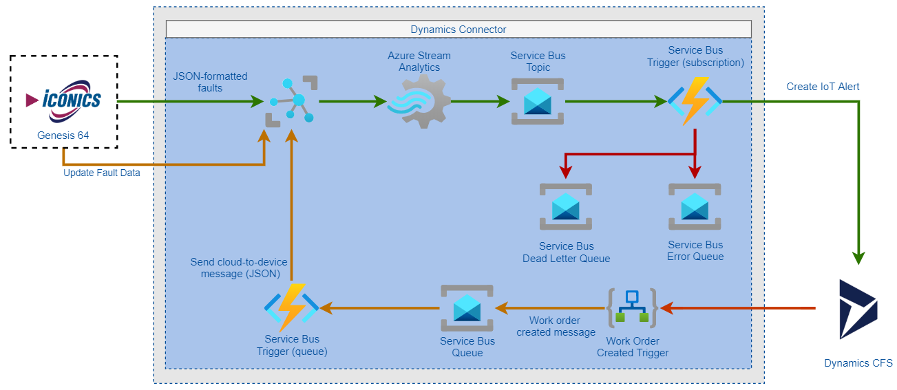

# Load Test Report

## Executive Summary

Two load tests were performed on October 7, 2020 at 6:01PM UTC and 7:16PM UTC, respectively. The first test ran using the _burst_ profile, sending 666 requests over 30 minutes, while the second utilized the _storm_ profile, sending 29,460 over 30 minutes. The load tests were performed against the IoT Hub that acts as the ingress point for the Field Service Connector using Locust and Azure Container Instances. The messages moved through the IoT Hub to a Service Bus Topic, via a Stream Analytics job, before being picked up by the Azure Function tasked with creating the Dynamics Asset and Alert:

The system performed well under burst load, averaging 1.81 seconds between initial request and Dynamics Alert creation, with 75% of the operations completed within 1.3 seconds. Under the storm load, the average jumps to 21 seconds, though 50% fell under 1.4 seconds. Seventy-five percent of the operations, however, fell under 42 seconds. It would seem that somewhere between the 50% and 75% thresholds, requests reached a tipping point that caused operation time to climb considerably. All operations fell well under the stated end-to-end latency goal of 5 minutes, with the maximum operation lasting 1 minute 28 seconds during the storm run, and 40 seconds during the burst one. Given the storm profile sent ~30,000 requests through the system in 30 minutes, the Field Service Connector can assuredly process the stated 30,000 request load over the course of 24 hours and stay under the 5 minute threshold.

**Burst**

| Average Elapsed Time | Max Elapsed Time | Min Elapsed Time | 25%      | 50%      | 75%      | 99%      |
| -------------------- | ---------------- | ---------------- | -------- | -------- | -------- | -------- |
| 1813.922             | 40392.46         | 367.57           | 1192.844 | 1289.749 | 1388.042 | 27529.44 |

**Storm**
| Average Elapsed Time | Max Elapsed Time | Min Elapsed Time | 25% | 50% | 75% | 99% |
|----------------------|------------------|------------------|---------|----------|----------|----------|
| 21093.42 | 88066.51 | 324.999 | 587.207 | 1376.166 | 41556.01 | 79919.87 |

_All values are displayed in milliseconds_

The Azure Function responsible for creating Dynamics Assets and Alerts scaled to 1 instance and maintained that number for the duration of the burst run. During the storm run, however, it scaled to 3 instances. In the results below, the peaks in function execution time (6:10PM during the burst run and 7:23PM, 7:42PM, and 7:52 PM during the storm run) are followed by steep declines. These reductions in function execution time correspond perfectly to the moments when the Azure Function scaled up to handle additional load. Calls to the Dynamics API did not add significant latency, nor were they markedly affected by the difference in load between the burst and storm profiles, moving from an average of to 95.8 to 107.9 milliseconds.

**100%** of the operations completed in under 5 minutes, and the system encountered **0** exceptions.

## Burst

### End-to-End Operation Duration

### Average Function Execution Duration

### Function Instance Count

The function scaled to 1 instance and maintained that number throughout the run.

### Function Execution Duration

### Dependencies

### Longest Running Function Executions

### Service Bus Incoming and Outgoing Messages

## Storm

### End-to-End Operation Duration

### Average Function Execution Duration

### Function Instance Count

### Function Execution Duration

### Dependencies

### Longest Running Function Executions

### Service Bus Incoming and Outgoing Messages

## Locust Statistics

The following statistics refer to the requests sent via Locust to the IoT Hub:

### Burst Configuration

|                  |      |
| ---------------- | ---- |
| Workers          | 1    |
| Users            | 1    |
| Hatch Rate       | 1.00 |
| Run Duration (s) | 1800 |

### Burst Requests

| Type | Name               | Request Count | Failure Count | Median Response Time | Average Response Time | Min Response Time | Max Response Time | Average Content Size | Requests/s | Failures/s | 50% | 66% | 75% | 80% | 90% | 95% | 98% | 99%  | 99.90% | 99.99% | 100.00% | 100%  |
| ---- | ------------------ | ------------- | ------------- | -------------------- | --------------------- | ----------------- | ----------------- | -------------------- | ---------- | ---------- | --- | --- | --- | --- | --- | --- | --- | ---- | ------ | ------ | ------- | ----- |
| POST | BXConnectorRequest | 666           | 0             | 91                   | 198.1921              | 72.60776          | 35376.68          | 0                    | 0.370416   | 0          | 91  | 100 | 130 | 140 | 190 | 420 | 740 | 1300 | 35000  | 35000  | 35000   | 35000 |
|      | Aggregated         | 666           | 0             | 91                   | 198.1921              | 72.60776          | 35376.68          | 0                    | 0.370416   | 0          | 91  | 100 | 130 | 140 | 190 | 420 | 740 | 1300 | 35000  | 35000  | 35000   | 35000 |

### Burst Failures

No failures occurred as part of the test.

### Storm Configuration

|                  |      |
| ---------------- | ---- |
| Workers          | 1    |
| Users            | 18   |
| Hatch Rate       | 1.00 |
| Run Duration (s) | 1800 |

### Storm Requests

| Type | Name               | Request Count | Failure Count | Median Response Time | Average Response Time | Min Response Time | Max Response Time | Average Content Size | Requests/s | Failures/s | 50% | 66% | 75% | 80% | 90% | 95% | 98% | 99% | 99.90% | 99.99% | 100.00% | 100% |
| ---- | ------------------ | ------------- | ------------- | -------------------- | --------------------- | ----------------- | ----------------- | -------------------- | ---------- | ---------- | --- | --- | --- | --- | --- | --- | --- | --- | ------ | ------ | ------- | ---- |
| POST | BXConnectorRequest | 29460         | 0             | 88                   | 94.03836              | 70.59956          | 734.802           | 0                    | 16.36588   | 0          | 88  | 92  | 94  | 97  | 110 | 120 | 170 | 220 | 510    | 700    | 730     | 730  |
|      | Aggregated         | 29460         | 0             | 88                   | 94.03836              | 70.59956          | 734.802           | 0                    | 16.36588   | 0          | 88  | 92  | 94  | 97  | 110 | 120 | 170 | 220 | 510    | 700    | 730     | 730  |

### Storm Failures

No failures occurred as part of the test.

## Artifacts

- [Burst](https://dev.azure.com/dynamicscollab/fieldservice/_build/results?buildId=2011&view=artifacts&type=publishedArtifacts)
- [Storm](https://dev.azure.com/dynamicscollab/fieldservice/_build/results?buildId=2012&view=artifacts&type=publishedArtifacts)

## Resources

- [How to Make a Bar Chart in Excel](https://www.smartsheet.com/bar-charting-excel-bar-graph#:~:text=How%20to%20Make%20a%20Bar%20Chart%20in%20Excel,we%20are%20using%20here%2C%20the%20results%20will%20)
